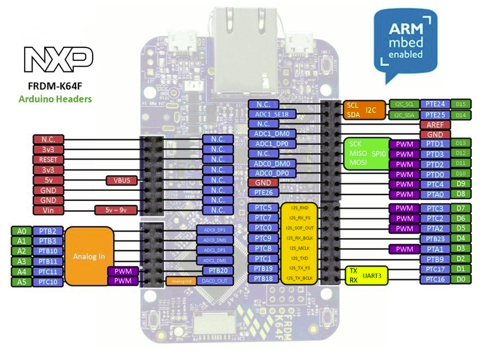

# robotic_arm
# Objective: Build a pick and place robotic arm
 
 

# Introduction:
 
The hardware is provided.Therefore, we only neeed to write the software on the NXP FRDM-K64F developement board. The operating system chosen is amazon FreeRTOS. The software is written using the mcuxpresso ide.

 
FRDM-K64F board pinout diagram
 

  

 
 

# Requirements:
 
mcuxpresso ide 
 
nxp frdm-k64f dev board 
 
pololu stepper motor driver 
 
 

# Code mplementation:
 
The following files are used; robotic_arm.c, motor_driver.c and motor_driver.h 
 
In the file robotic_arm.c, the board configuration, bringup and the main method code are implemented here.
 
Function declarations are done in the motor_driver.h file
 
The function implementation is done in the motor_driver.c file.
 
Th following functions are used: 
	tasks_init(),
	drive_motor_1(),
	drive_motor_2(),
	drive_motor_3(),
	drive_motor_4() and 
	drive_motor_5().
 
(a) tasks_init:
 
This function initializes all the tasks that will run independently. These tasks are drive_motor_n with n taking values 1,2,3,4 and 5.
This function is called in the main method. 
 
(b) drive_motor_n:
 
This function implements the tasks used to drive the motors. GPIO pin configuration is done in this function. The tasks are not set in the infinite loop of the main method as they are to run independently.The step and direction pins of the motor drivers are connected to the digital GPIO of the dev board. Writing the direction pin high, enables the clockwise, while low will enable the anti-clockwise direction. To enable the motor rotation, step pin is written high.The motors are set to run in an inifinite loop of 5 steps in both directions.  

   	

